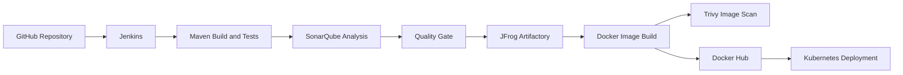

# Automated CI/CD Application

A Java registration application demonstrating a complete CI/CD workflow from source-code checkout to Kubernetes deployment.

The project integrates Jenkins, Maven, SonarQube, JFrog Artifactory, Docker, Trivy, Kubernetes, and Terraform.

## Architecture



## Technology Stack

| Area | Technologies |
|---|---|
| Application | Java |
| Build and Testing | Maven |
| CI/CD | Jenkins |
| Code Quality | SonarQube |
| Artifact Repository | JFrog Artifactory |
| Containers | Docker |
| Security Scanning | Trivy |
| Orchestration | Kubernetes |
| Infrastructure as Code | Terraform |
| Source Control | Git, GitHub |

## Repository Structure

```text
.
├── server/
├── webapp/
├── kubernetes/
│   ├── deployment.yml
│   └── service.yml
├── Terraform/
├── Dockerfile
├── Jenkinsfile
├── pom.xml
└── README.md
```

## Project Features

- Automated Maven build, test, and packaging.
- SonarQube code-quality analysis.
- Quality-gate verification before deployment.
- Artifact publishing through JFrog Artifactory.
- Docker image creation and publishing to Docker Hub.
- Trivy vulnerability scanning for container images.
- Kubernetes deployment with two application replicas.
- Automated rollout restart and deployment verification.
- Terraform infrastructure configuration for cloud automation.
- Email notifications for successful and failed builds.

## Prerequisites

Install or configure the following:

- Java
- Maven
- Docker
- kubectl
- Kubernetes cluster
- Jenkins
- SonarQube
- JFrog Artifactory
- Trivy
- Docker Hub account

## Run Locally

Build and test the application:

```bash
mvn clean test package
```

Build the Docker image:

```bash
docker build -t register-app-pipeline:local .
```

Run the container:

```bash
docker run --rm -p 8080:8080 register-app-pipeline:local
```

The application should be available at:

```text
http://localhost:8080
```

## Kubernetes Deployment

Apply the Kubernetes Deployment and Service:

```bash
kubectl apply -f kubernetes/deployment.yml
kubectl apply -f kubernetes/service.yml
```

Check the application resources:

```bash
kubectl get deployments
kubectl get pods
kubectl get services
```

Check the rollout:

```bash
kubectl rollout status deployment/registerapp-deployment
```

Restart the deployment when required:

```bash
kubectl rollout restart deployment/registerapp-deployment
```

## Jenkins CI/CD Pipeline

The pipeline is defined in [`Jenkinsfile`](Jenkinsfile).

Pipeline stages:

1. Clean the Jenkins workspace.
2. Checkout the source code from GitHub.
3. Build, test, and package the Java application using Maven.
4. Run SonarQube code-quality analysis.
5. Validate the SonarQube quality gate.
6. Publish build artifacts to JFrog Artifactory.
7. Build and tag the Docker image.
8. Push the image to Docker Hub.
9. Scan the image using Trivy.
10. Deploy the application to Kubernetes.
11. Restart the Kubernetes deployment.
12. Send build-status notifications.

## Jenkins Configuration

The Jenkins agent should have access to:

- Maven
- Docker
- kubectl
- Kubernetes credentials
- SonarQube
- JFrog Artifactory
- Email notification services

The pipeline uses the following credential integrations:

```text
github-token-auth
docker-hub
SonarQube-token
jfrog
kubernetes
```

Credential values should be stored securely in Jenkins and must not be committed to this repository.

## Docker Image Tagging

The pipeline creates a versioned image tag using the release version and Jenkins build number:

```text
<release>-<build-number>
```

Example:

```text
1.0.0-25
```

Versioned image tags make it possible to identify and roll back to a specific build.

## Terraform

The [`Terraform`](Terraform/) directory contains infrastructure-as-code configuration for cloud automation.

Typical Terraform workflow:

```bash
terraform init
terraform fmt -check
terraform validate
terraform plan
terraform apply
```

Review the Terraform plan carefully before applying infrastructure changes.

## Security and Quality Improvements

Before using this project in a production environment:

- Store all endpoints and notification addresses in Jenkins configuration.
- Use immutable Docker image tags instead of relying on `latest`.
- Configure Trivy to fail the build for high and critical vulnerabilities.
- Make the SonarQube quality gate block deployment when it fails.
- Add Kubernetes readiness and liveness probes.
- Add CPU and memory resource limits.
- Use Kubernetes Secrets for application credentials.
- Restrict Kubernetes and cloud-network access.
- Add deployment rollback support.
- Add automated tests for the deployment process.

## Future Improvements

- Add GitHub Actions for pull-request validation.
- Add Prometheus metrics and Grafana dashboards.
- Add Helm charts for Kubernetes deployment.
- Add Terraform modules for reusable infrastructure.
- Add blue-green or canary deployments.
- Add centralized logging.
- Add automated rollback when deployment health checks fail.

## Project Status

This is a DevOps portfolio project demonstrating automated Java application delivery using Jenkins, Docker, Kubernetes, Terraform, code-quality analysis, artifact management, and container security scanning.
